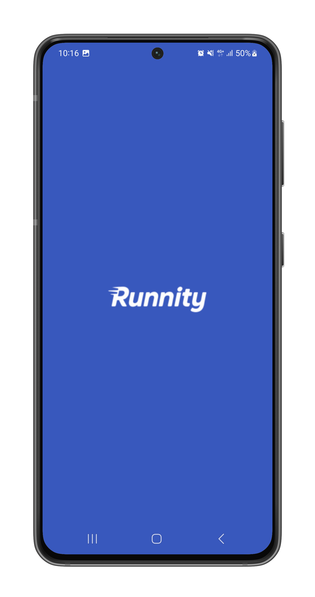
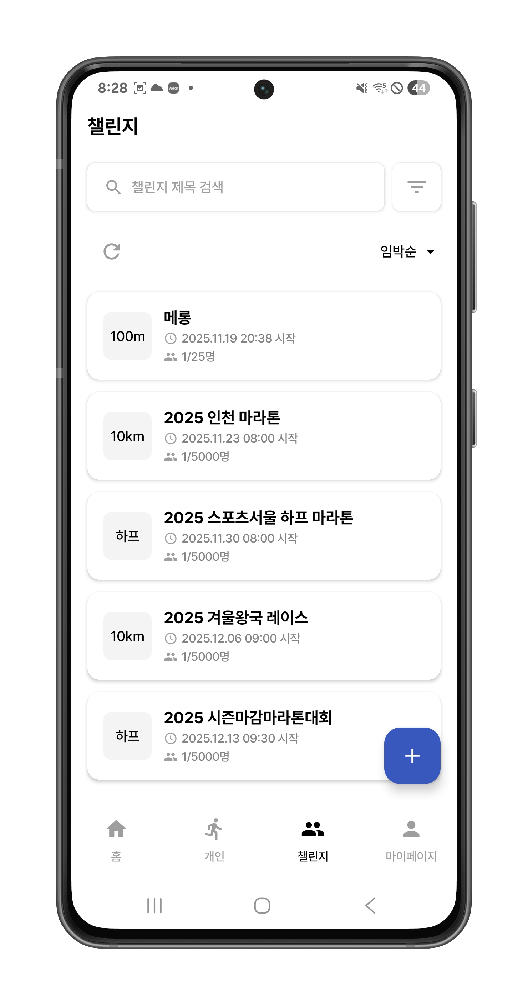
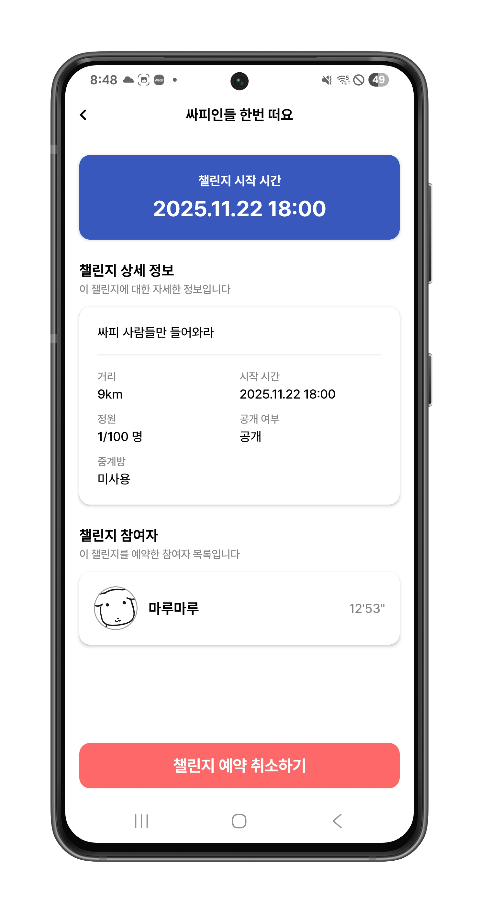
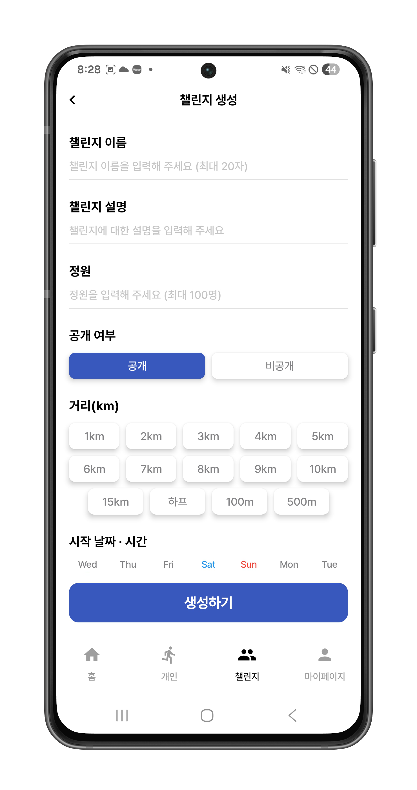
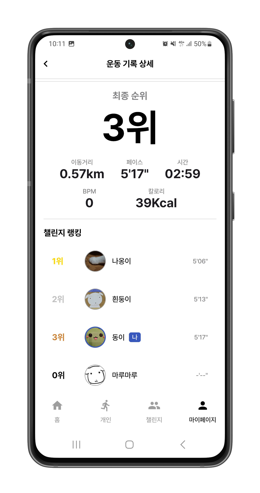
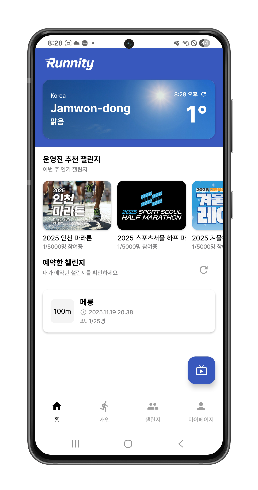
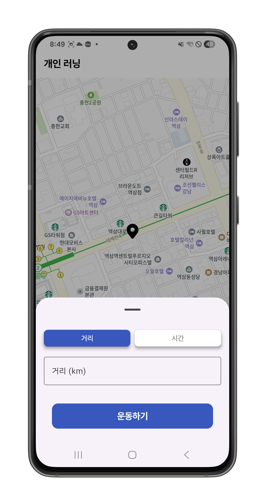
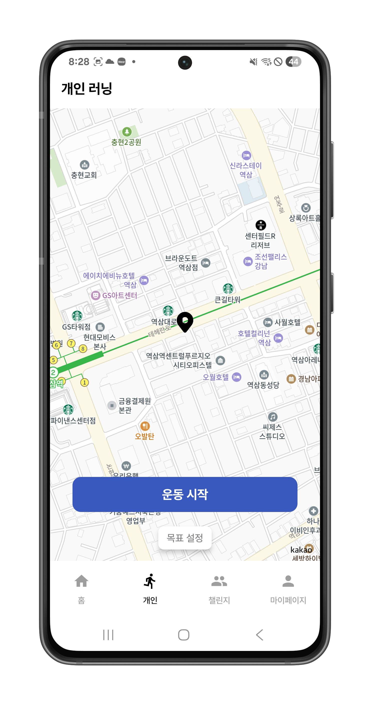
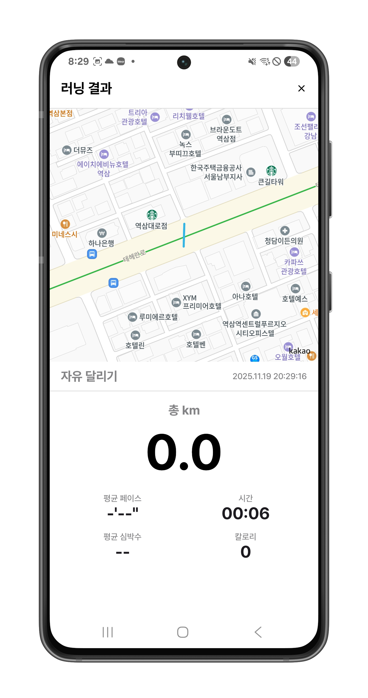

<h1 style="background-color: #3958bd; color: white; padding: 20px; border-radius: 10px; margin: 0; display: inline-block;">Runnity</h1>

 

## 📚 목차

1.  [**프로젝트 개요**](#-프로젝트-개요)

2.  [**핵심 기능 소개**](#-핵심-기능-소개)

3.  [**서비스 소개**](#-서비스-소개)

4.  [**프로젝트 설계**](#-프로젝트-설계)

5.  [**기술 스택**](#-기술-스택)

6.  [**팀원 소개**](#-팀원-소개)

 

## 📄 프로젝트 개요

> **개발 기간** : `2025.10.10 ~ 2025.11.20`

**Runnity**는 러너들이 실시간으로 운동 데이터를 공유하며 함께 달릴 수 있는 **러닝 챌린지 플랫폼**입니다.
개인 러닝과 그룹 챌린지를 지원하며, WebSocket 기반 실시간 데이터 공유와 AI 중계 기능으로 몰입감을 높였습니다.

 

## ✨ 핵심 기능 소개

### 1. 실시간 러닝 챌린지

- **챌린지 생성/참여**: 거리(3km, 5km, 10km 등)와 공개 범위를 설정해 챌린지를 만들고 참여할 수 있습니다.

- **운동 데이터 실시간 공유**: WebSocket으로 거리, 페이스, 시간 등 운동 데이터를 주고받으며 함께 달립니다.

- **실시간 랭킹**: 거리와 페이스를 기반으로 순위를 계산해 경쟁 요소를 제공합니다.

 

### 2. 중계방 스트리밍

- **라이브 스트리밍**: 챌린지 상황을 실시간으로 중계해 시청자들이 참가자들의 러닝을 관전할 수 있습니다.

- **AI 하이라이트**: Kafka로 수집한 데이터를 분석해 러닝 중 주요 순간을 자동 생성합니다.

 

### 3. 러닝 기록 및 통계

- **기록 관리**: 개인 러닝과 챌린지 기록을 구분해 거리, 페이스, 랩 타임 등 상세 정보를 제공합니다.
- **통계 대시보드**: 주/월/년 데이터를 시각화해 러닝 추이를 확인할 수 있습니다.

 

### 4. Wear OS 지원

- **스마트워치 연동**: Wear OS 기기로 러닝 중에도 실시간 데이터를 확인하고 간편하게 제어할 수 있습니다.

 

### 5. 소셜 기능

- **소셜 로그인**: Google, Kakao 로그인을 지원합니다.

- **프로필 관리**: 프로필 이미지, 닉네임 등 개인 정보를 관리할 수 있습니다.

 

 

## 💻 서비스 소개

### 1️⃣ **온보딩 및 로그인**

> 소셜 로그인으로 간편하게 시작할 수 있습니다.

| 온보딩 화면 |
| :---: |
|  |

 

### 2️⃣ **챌린지 생성 및 참여**

> 다양한 옵션으로 챌린지를 만들고 참여할 수 있습니다.

| 챌린지 목록 | 챌린지 상세 |
| :---: | :---: |
|  |  |

| 챌린지 생성 | 챌린지 결과 |
| :---: | :---: |
|  |  |

 

### 3️⃣ **실시간 러닝 데이터 공유**

> WebSocket으로 거리, 시간, 페이스 등 운동 데이터를 실시간 주고받습니다.

| 메인 홈 | 개인 러닝 목표 설정 |
| :---: | :---: |
|  |  |

| 개인 러닝 시작 전 | 개인 러닝 진행 중 |
| :---: | :---: |
|  |  |

| 개인 러닝 결과 |
| :---: |
|  |

 

### 4️⃣ **중계방 스트리밍**

> 챌린지 진행 상황을 실시간 중계하며, AI가 중계 메세지를 생성합니다.

| 중계방 스트리밍 |
| :---: |
| 
중계방 기능 화면 (추가 예정)
 |

 

### 5️⃣ **러닝 기록 및 통계**

> 달린 기록을 확인하고 나만의 통계를 관리할 수 있습니다.

| 러닝 기록 및 통계 |
| :---: |
| 
러닝 기록 및 통계 화면 (추가 예정)
 |

 

### 6️⃣ **마이페이지**

> 사용자 정보를 확인하고 수정할 수 있습니다.

| 마이페이지 |
| :---: |
| 
마이페이지 화면 (추가 예정)
 |

 

 

## 🛠️ 프로젝트 설계

### 시스템 아키텍처

### 주요 컴포넌트

1. **Backend Server**: API 제공, 사용자 및 챌린지 관리
2. **WebSocket Server**: 운동 데이터 실시간 송수신
3. **Stream Server**: 라이브 중계 처리
4. **AI Server**: 운동 데이터 기반 하이라이트 생성
5. **Redis**: 캐싱 및 Pub/Sub 메시지 처리
6. **Kafka**: 서버 간 이벤트 스트리밍

 

## ⚙️ 기술 스택

| 분류 | 기술 스택 |
| :---: | :--- |
| **Frontend** |     |
| **Backend** |    |
| **AI** |   |
| **Database** |    |
| **Infra** |      |

### 상세 기술 스택

#### Frontend
- Kotlin, Jetpack Compose (MVVM)
- Retrofit, OkHttp, Coroutines, Flow
- Hilt, Kakao Map SDK
- Google/Kakao 로그인, FCM 알림, Wear OS 연동

#### Backend
- Java 17, Spring Boot 3.5.7
- Gradle 8.14.3, JPA, Hibernate
- JWT, OAuth2 인증
- Swagger 문서화, AWS S3 연동

#### AI Server
- Python 3.11, FastAPI, Uvicorn
- Kafka (kafka-python), Threading

#### Infrastructure
- Ubuntu 24.04, Docker, Docker Compose
- Jenkins, Nginx (SSL, Reverse Proxy)
- Let's Encrypt 인증서
- Prometheus, Grafana 모니터링

 

 

## 👨‍👩‍👧‍👦 팀원 소개

<table>
<tr>
<td align="center" width="33%">

 
<b>신상원</b>
 
<i>팀장 / FE</i>
</td>
<td align="center" width="33%">

 
<b>김동휘</b>
 
<i>BE</i>
</td>
<td align="center" width="33%">

 
<b>김상경</b>
 
<i>BE</i>
</td>
</tr>
<tr>
<td align="center" width="33%">

 
<b>윤선호</b>
 
<i>BE</i>
</td>
<td align="center" width="33%">

 
<b>이상민</b>
 
<i>INFRA</i>
</td>
<td align="center" width="33%">

 
<b>이다예</b>
 
<i>FE</i>
</td>
</tr>
<tr>
<td align="center" width="33%">

 
<b>조예림</b>
 
<i>BE</i>
</td>
<td align="center" width="33%">
</td>
<td align="center" width="33%">
</td>
</tr>
</table>

 
 